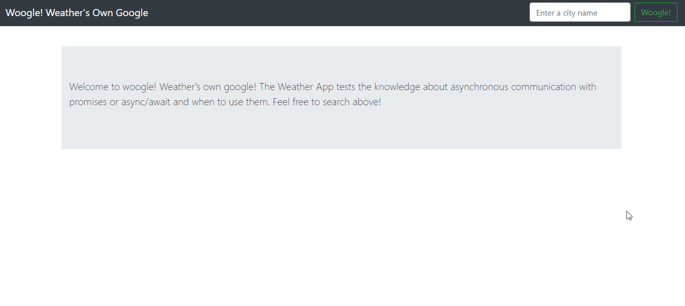

# Woogle

 

  

  <h3 align="center">Weathers Own Google</h3>

  

    <a href="https://github.com/simandebvu/weather-app/"><strong>Explore the docs »</strong></a>
     
     
    <a href="https://github.com/simandebvu/weather-app/issues/">Report Bug</a>
    ·
    <a href="https://github.com/simandebvu/weather-app/">Request Feature</a>
  

> Woogle allows the user to search for a specific location by typing a city name in the search input. Initially the temperature will be displayed in Celsius degrees, and by clicking on the toggle button temperature it toggles between Celsius and Fahrenheit temperatures.

> If the city name does not exist or is misspelled the ES6 Promises will then catch the error and will inform the user about it.

## Built With

- Javascript
- Node
- Webpack 
- Bootstrap
- VSCode
- ESLint
- Stylelint
- Github Actions

## Prerequisites

- Node ^10
- npm ^6
  
## Live Demo

[Live Demo Link](https://github.com/simandebvu/weather-app/)

## Running Locally

Clone the repo:

`git clone https://github.com/simandebvu/weather-app.git`

Inside the root folder of the project, install the node packages:

`npm install`

Go to the root folder and run the npm server script:

`npm run server`
  
## Authors

👤 **Shingirayi Mandebvu**

- Github: [@simandebvu](https://github.com/simandebvu)
- Twitter: [@simandebvu](https://twitter.com/simandebvu)
- Linkedin: [linkedin](https://linkedin.com/in/simandebvu)

## 🤝 Contributing

Contributions, issues and feature requests are welcome!

Feel free to check the [issues page](issues/).

## Show your support

Give a ⭐️ if you like this project!

## Acknowledgments

- Microverse

## 📝 License

This project is [MIT](lic.url) licensed.
